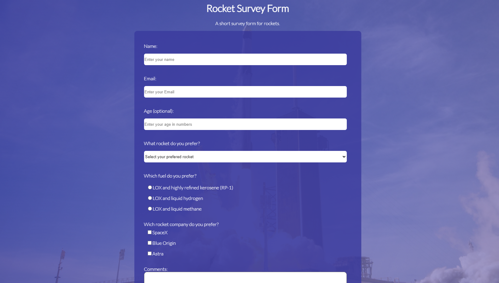

# Survey Form

Este projeto é uma forma de pesquisa desenvolvida utilizando HTML, CSS e Flexbox. O objetivo é criar uma forma simples e intuitiva para coletar dados dos usuários. Pode ser acessado em [SurveyForm](https://pedroddjkkk.github.io/SurveyForm/).

## Tecnologias utilizadas
- HTML
- CSS
- Flexbox
- Design Responsivo

## Instalação
Para instalar este projeto, você precisará clonar o repositório para sua máquina local.
```bash
git clone https://github.com/pedroddjkkk/SurveyForm
```

## Uso
Abra o arquivo index.html no seu navegador para visualizar o projeto.

## Fotos do projeto




## Licença
Este projeto está licenciado sob a licença MIT. Veja o arquivo [LICENSE](https://github.com/pedroddjkkk/SurveyForm/blob/main/LICENSE) para mais informações.
